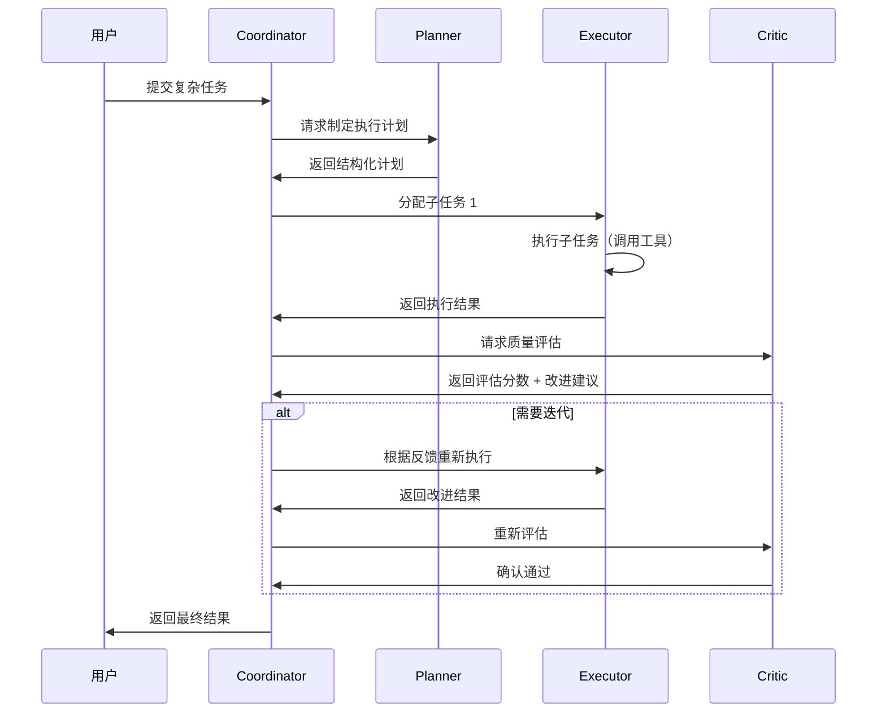

# 22 - 多 Agent 与 Multi-Agent RL

> **学习目标**：了解多 Agent 系统的训练方法，掌握 CTDE 架构和 Self-Play 等前沿技术，理解多 Agent 协作的 RL 训练范式。

---

## 22.1 从单 Agent 到多 Agent

### 22.1.1 单 Agent 的局限

单个 Agent 难以处理:
- 需要多种专业知识的复杂任务
- 需要协作的团队任务
- 需要辩论/验证的开放性问题

### 22.1.2 多 Agent 的优势

```
Multi-Agent System（多智能体系统）:

Agent A (Expert 1, 专家1) ←→ Agent B (Expert 2, 专家2)
         ↓                           ↓
    Agent C (Coordinator, 协调者)
         ↓
    Final Output（最终输出）

优势：
- 专业分工：每个 Agent 专注一个领域
- 互相验证：Agent 之间可以检查和纠正
- 并行处理：多个 Agent 同时处理不同子任务
```

---

## 22.2 Multi-Agent 系统架构

### 22.2.1 角色定义

```python
"""多 Agent 系统的角色定义"""
from dataclasses import dataclass
from typing import List, Optional


@dataclass
class AgentRole:
    """Agent 角色定义"""
    name: str              # 角色名称
    description: str       # 角色描述
    system_prompt: str     # 系统提示
    tools: List[str]       # 可用工具列表
    model_path: str        # 使用的模型路径


# 定义一个典型的多 Agent 系统角色配置
AGENT_ROLES = {
    "planner": AgentRole(
        name="Planner",
        description="负责制定计划和分解任务",
        system_prompt="""你是一个任务规划专家。
你的职责是：
1. 分析用户的需求
2. 将复杂任务分解为子任务
3. 为每个子任务指定执行者和优先级
4. 输出结构化的执行计划""",
        tools=["search", "calculator"],
        model_path="Qwen/Qwen2.5-3B-planner",
    ),
    "executor": AgentRole(
        name="Executor",
        description="负责执行具体的子任务",
        system_prompt="""你是一个任务执行专家。
你的职责是：
1. 根据分配到的子任务，使用工具完成执行
2. 返回执行结果和状态
3. 如果遇到问题，向 Coordinator 报告""",
        tools=["code_interpreter", "search", "file_system"],
        model_path="Qwen/Qwen2.5-3B-executor",
    ),
    "critic": AgentRole(
        name="Critic",
        description="负责评估和反馈执行结果",
        system_prompt="""你是一个质量评估专家。
你的职责是：
1. 评估 Executor 的执行结果
2. 检查结果的准确性和完整性
3. 如果结果不满意，提出改进建议
4. 输出评估分数和改进意见""",
        tools=["calculator"],
        model_path="Qwen/Qwen2.5-3B-critic",
    ),
    "coordinator": AgentRole(
        name="Coordinator",
        description="负责协调各 Agent 的工作",
        system_prompt="""你是一个团队协调者。
你的职责是：
1. 接收用户请求
2. 将任务分配给 Planner 制定计划
3. 按计划将子任务分配给 Executor
4. 收集 Critic 的评估反馈
5. 综合所有结果生成最终输出""",
        tools=[],
        model_path="Qwen/Qwen2.5-7B-coordinator",  # 协调者用更大模型
    ),
}
```

### 22.2.2 多 Agent 协作时序

以下时序图展示了 Planner、Executor、Critic、Coordinator 四个角色在典型任务中的协作流程：



每条消息都通过 MessageBus 中转，支持异步通信和消息历史回溯。

### 22.2.3 多 Agent 通信协议

```python
"""多 Agent 通信协议"""
import asyncio
from dataclasses import dataclass
from typing import Any, Optional
from enum import Enum


class MessageType(Enum):
    TASK_ASSIGN = "task_assign"      # 任务分配
    TASK_RESULT = "task_result"      # 任务结果
    FEEDBACK = "feedback"            # 反馈
    QUERY = "query"                  # 询问
    FINAL_OUTPUT = "final_output"    # 最终输出


@dataclass
class AgentMessage:
    """Agent 之间的通信消息"""
    sender: str           # 发送者 Agent 名称
    receiver: str         # 接收者 Agent 名称
    msg_type: MessageType # 消息类型
    content: str          # 消息内容
    metadata: dict = None # 额外信息（如子任务 ID、评估分数等）
    timestamp: float = 0.0  # 时间戳
    
    def to_dict(self) -> dict:
        """序列化为字典（用于网络传输）"""
        return {
            "sender": self.sender,
            "receiver": self.receiver,
            "msg_type": self.msg_type.value,
            "content": self.content,
            "metadata": self.metadata or {},
            "timestamp": self.timestamp or __import__("time").time(),
        }
    
    @classmethod
    def from_dict(cls, data: dict) -> "AgentMessage":
        """从字典反序列化"""
        return cls(
            sender=data["sender"],
            receiver=data["receiver"],
            msg_type=MessageType(data["msg_type"]),
            content=data["content"],
            metadata=data.get("metadata"),
            timestamp=data.get("timestamp", 0.0),
        )
    
    def to_json(self) -> str:
        """序列化为 JSON 字符串"""
        import json
        return json.dumps(self.to_dict(), ensure_ascii=False)
    
    @classmethod
    def from_json(cls, json_str: str) -> "AgentMessage":
        """从 JSON 字符串反序列化"""
        import json
        return cls.from_dict(json.loads(json_str))


class MessageBus:
    """Agent 通信总线
    
    所有 Agent 之间的通信都通过 MessageBus 中转，
    支持消息路由、历史记录和异步通信。
    使用 asyncio.Lock 保证多 Agent 并发安全。
    """
    
    def __init__(self):
        self.message_history: list = []
        self.pending_messages: dict = {}  # receiver -> [messages]
        self._lock = asyncio.Lock()  # 异步锁，保证并发安全
    
    async def send(self, message: AgentMessage):
        """发送消息（异步安全）"""
        async with self._lock:
            self.message_history.append(message)
            
            receiver = message.receiver
            if receiver == "all":
                for agent_name in self.pending_messages:
                    self.pending_messages[agent_name].append(message)
            else:
                if receiver not in self.pending_messages:
                    self.pending_messages[receiver] = []
                self.pending_messages[receiver].append(message)
    
    async def receive(self, agent_name: str) -> list:
        """接收指定 Agent 的所有待处理消息（异步安全）"""
        async with self._lock:
            messages = self.pending_messages.pop(agent_name, [])
            return messages
    
    def get_conversation_history(self, agent_a: str, agent_b: str) -> list:
        """获取两个 Agent 之间的对话历史"""
        return [
            m for m in self.message_history
            if (m.sender == agent_a and m.receiver == agent_b) or
               (m.sender == agent_b and m.receiver == agent_a)
        ]
```

---

### 22.2.4 通信开销分析与优化

多 Agent 系统中，通信是性能瓶颈之一。以下是典型开销数据和优化策略：

| 场景 | 平均消息大小 | 延迟 | 每秒消息数 | 瓶颈 |
|-----|------------|------|-----------|------|
| Planner → Coordinator | 2-8 KB（计划文本） | 10-50ms | 1-5 | 序列化 |
| Executor → Coordinator | 1-100 KB（工具返回） | 100ms-5s | 1-10 | 网络传输 |
| Critic → Coordinator | 0.5-2 KB（评估分数） | 10-30ms | 1-5 | 无显著瓶颈 |

**优化策略：**

1. **消息压缩**：大工具返回结果（如网页内容）先摘要再传输
2. **批处理通信**：多条消息合并为一次网络请求
3. **异步非阻塞**：使用 `asyncio` 避免等待通信
4. **选择性广播**：只对相关 Agent 发送消息，避免全局广播

```python
"""通信优化：工具结果自动摘要，减少传输量"""

async def summarize_tool_result(result: str, max_chars: int = 2000) -> str:
    """对工具返回结果进行摘要压缩"""
    if len(result) <= max_chars:
        return result
    # 保留首尾关键信息
    head = result[:max_chars // 2]
    tail = result[-max_chars // 4:]
    head += f"\n...(中间省略 {len(result) - max_chars} 字符)...\n"
    return head + tail
```

---

## 22.3 Multi-Agent RL 训练方法

### 22.3.1 独立训练（Independent Training）

```python
"""方法一：独立训练 —— 每个 Agent 独立用 GRPO 训练"""


def independent_training(
    agents: dict,           # {"planner": model, "executor": model, ...}
    reward_fns: dict,       # {"planner": fn, "executor": fn, ...}
    training_data: list,    # 训练任务列表
    num_epochs: int = 5,
    lr: float = 1e-5,
):
    """独立训练每个 Agent
    
    每个 Agent 有自己的奖励函数、优化器，独立优化。
    简单但 Agent 之间不协调。
    
    Args:
        agents: Agent 名称到模型的映射
        reward_fns: Agent 名称到奖励函数的映射
        training_data: 训练任务
        num_epochs: 训练轮数
        lr: 学习率
    """
    import torch
    
    # 每个 Agent 创建独立的优化器
    optimizers = {
        name: torch.optim.AdamW(model.parameters(), lr=lr)
        for name, model in agents.items()
    }
    
    for epoch in range(num_epochs):
        for task in training_data:
            for agent_name, agent_model in agents.items():
                # 每个 Agent 的梯度清零
                optimizers[agent_name].zero_grad()
                
                # 1. Agent 执行任务（Rollout）
                trajectory = agent_model.generate_trajectory(task)
                
                # 2. 计算该 Agent 的独立奖励
                reward = reward_fns[agent_name](trajectory, task)
                
                # 3. 计算损失并更新（每个 Agent 独立更新）
                loss = compute_grpo_loss(
                    agent_model, trajectory, reward
                )
                loss.backward()
                optimizers[agent_name].step()
```

### 22.3.2 集中训练（Centralized Training）

```python
"""方法二：集中训练 —— 全局 Reward，所有 Agent 共享"""


def centralized_training(
    agents: dict,
    global_reward_fn,     # 全局奖励函数
    training_data: list,
    num_epochs: int = 5,
    lr: float = 1e-5,
):
    """集中训练
    
    一个全局奖励函数评估所有 Agent 的整体表现，
    所有 Agent 共享同一个奖励信号。
    鼓励协作但信用分配困难。
    """
    import torch
    
    optimizers = {
        name: torch.optim.AdamW(model.parameters(), lr=lr)
        for name, model in agents.items()
    }
    
    for epoch in range(num_epochs):
        for task in training_data:
            # 清零所有 Agent 的梯度
            for opt in optimizers.values():
                opt.zero_grad()
            
            all_trajectories = {}
            
            # 1. 所有 Agent 协作完成任务
            for agent_name, agent_model in agents.items():
                trajectory = agent_model.generate_trajectory(task)
                all_trajectories[agent_name] = trajectory
            
            # 2. 计算全局奖励（评估整体表现）
            global_reward = global_reward_fn(all_trajectories, task)
            
            # 3. 每个 Agent 都用全局奖励更新
            for agent_name, agent_model in agents.items():
                loss = compute_grpo_loss(
                    agent_model,
                    all_trajectories[agent_name],
                    global_reward,
                )
                loss.backward()
                optimizers[agent_name].step()
```

### 22.3.3 CTDE（Centralized Training with Decentralized Execution）

```python
"""方法三：CTDE —— 集中训练，分散执行（当前主流方法）"""
import torch


class CTDEMultiAgentTrainer:
    """CTDE 多 Agent 训练器
    
    训练时：有全局信息（所有 Agent 的状态和动作）
    执行时：每个 Agent 只看自己的观测
    
    这是目前 Multi-Agent RL 的主流方法。
    """
    
    def __init__(self, agents: dict, critic_model, global_reward_fn, lr: float = 1e-5):
        """
        Args:
            agents: Agent 字典 {name: policy_model}
            critic_model: 集中式评论家（训练时使用，执行时不用）
            global_reward_fn: 全局奖励函数
            lr: 学习率
        """
        self.agents = agents
        self.critic = critic_model  # 集中式 Critic
        self.global_reward_fn = global_reward_fn
        
        # 为每个 Agent 策略和 Critic 分别创建优化器
        self.optimizers = {
            name: torch.optim.AdamW(model.parameters(), lr=lr)
            for name, model in agents.items()
        }
        self.critic_optimizer = torch.optim.AdamW(critic_model.parameters(), lr=lr)
    
    def train_step(self, task: dict) -> dict:
        """单步 CTDE 训练
        
        Returns:
            训练指标
        """
        # === 阶段 1: 分散执行（Decentralized Execution）===
        # 每个 Agent 只根据自己的观测做决策
        all_trajectories = {}
        all_observations = {}
        
        for agent_name, agent_model in self.agents.items():
            # Agent 只能看到自己的观测（不是全局状态）
            local_obs = task.get(f"obs_{agent_name}", task)
            trajectory = agent_model.generate_trajectory(local_obs)
            all_trajectories[agent_name] = trajectory
            all_observations[agent_name] = local_obs
        
        # === 阶段 2: 集中训练（Centralized Training）===
        # Critic 可以看到全局状态（所有 Agent 的观测和动作）
        global_state = {
            "observations": all_observations,
            "trajectories": all_trajectories,
            "task": task,
        }
        
        # 计算全局奖励
        global_reward = self.global_reward_fn(all_trajectories, task)
        
        # 集中式 Critic 评估每个 Agent 的贡献（信用分配）
        agent_contributions = self.critic.estimate_contributions(
            global_state, global_reward
        )
        
        # === 阶段 3: 更新各 Agent 策略 ===
        losses = {}
        for agent_name, agent_model in self.agents.items():
            # 使用 Critic 分配的贡献作为该 Agent 的奖励
            agent_reward = agent_contributions.get(agent_name, global_reward)
            
            loss = compute_grpo_loss(
                agent_model,
                all_trajectories[agent_name],
                agent_reward,
            )
            loss.backward()
            losses[agent_name] = loss.item()
        
        # 更新 Critic（用全局信息）
        critic_loss = self._update_critic(global_state, global_reward)
        
        # 更新所有模型（每个 Agent 用各自的优化器）
        for agent_name in self.agents:
            self.optimizers[agent_name].step()
        self.critic_optimizer.step()
        
        return {
            "agent_losses": losses,
            "critic_loss": critic_loss,
            "global_reward": global_reward,
            "contributions": agent_contributions,
        }
    
    def _update_critic(self, global_state: dict, global_reward: float) -> float:
        """更新集中式 Critic"""
        predicted_value = self.critic(global_state)
        critic_loss = (predicted_value - global_reward) ** 2
        critic_loss.backward()
        return critic_loss.item()
    
    def decentralized_execute(self, task: dict) -> dict:
        """分散执行（推理时使用，不需要 Critic）"""
        results = {}
        for agent_name, agent_model in self.agents.items():
            local_obs = task.get(f"obs_{agent_name}", task)
            result = agent_model.generate_trajectory(local_obs)
            results[agent_name] = result
        return results
```

---

### 22.3.4 Credit Assignment（信用分配）—— COMA 反事实基线

CTDE 的关键挑战：如何确定每个 Agent 对全局奖励的贡献？
COMA（Counterfactual Multi-Agent Policy Gradients）通过"反事实基线"解决：

```python
"""COMA 风格的反事实信用分配

核心思想：固定其他 Agent 的动作不变，只改变当前 Agent 的动作，
计算"如果 Agent 采取了不同动作，全局奖励会如何变化"。
这个差值就是该 Agent 的边际贡献。
"""


def counterfactual_credit_assignment(
    global_reward: float,
    trajectories: dict,
    agent_name: str,
    critic_model,
    global_state: dict,
) -> float:
    """计算单个 Agent 的边际贡献（反事实基线）
    
    Args:
        global_reward: 实际全局奖励
        trajectories: 所有 Agent 的轨迹
        agent_name: 要评估的 Agent
        critic_model: 集中式 Critic（可估计任意动作组合的价值）
        global_state: 全局状态
    
    Returns:
        该 Agent 的边际贡献分数
    """
    # 当前 Agent 的实际动作价值
    with torch.no_grad():
        actual_value = critic_model.estimate_value(
            global_state, trajectories[agent_name]
        )
        
        # 构造"反事实"状态：假设该 Agent 什么都没做
        counterfactual_traj = {"turns": [], "tool_calls": []}
        counterfactual_state = {**global_state}
        counterfactual_state["trajectories"] = {
            **trajectories,
            agent_name: counterfactual_traj,
        }
        
        counterfactual_value = critic_model.estimate_value(
            counterfactual_state, counterfactual_traj
        )
    
    # 边际贡献 = 实际价值 - 反事实价值（其他 Agent 固定）
    marginal_contribution = actual_value - counterfactual_value
    
    # 归一化到全局奖励尺度
    contribution_ratio = torch.sigmoid(marginal_contribution)
    return (contribution_ratio * global_reward).item()


# 在 CTDE 训练中使用（替换原来的抽象方法）:
def estimate_contributions(self, global_state, global_reward):
    """为每个 Agent 计算反事实信用分配"""
    contributions = {}
    for agent_name in self.agents:
        contributions[agent_name] = counterfactual_credit_assignment(
            global_reward=global_reward,
            trajectories=global_state["trajectories"],
            agent_name=agent_name,
            critic_model=self.critic,
            global_state=global_state,
        )
    return contributions
```

---

## 22.4 Self-Play（自我对弈）

### 22.4.1 概念

Self-Play 让 Agent 与自己的历史版本交互，生成高质量的训练数据。
类似 AlphaGo 的训练方式，在 Agentic RL 中用于提升 Agent 的对抗和协作能力。

```python
"""Self-Play 训练框架"""
import copy
from collections import deque


class SelfPlayTrainer:
    """Self-Play 训练器
    
    Agent 与自己的历史版本对弈：
    1. 当前版本 (π_current) 作为一方
    2. 历史版本 (π_opponent) 作为对手/协作者
    3. 根据对弈结果更新 π_current
    
    优势：
    - 无需人工标注数据
    - 自动产生难度递增的训练数据
    - Agent 不断挑战更强的对手
    """
    
    def __init__(self, agent_model, opponent_pool_size: int = 5):
        """
        Args:
            agent_model: 当前 Agent 模型
            opponent_pool_size: 历史版本池大小
        """
        self.current_model = agent_model
        self.opponent_pool = deque(maxlen=opponent_pool_size)
        
        # 初始化对手池（用初始模型）
        for _ in range(opponent_pool_size):
            self.opponent_pool.append(copy.deepcopy(agent_model))
    
    def self_play_round(self, task: dict) -> dict:
        """一轮 Self-Play 对弈
        
        Args:
            task: 对弈任务
        
        Returns:
            对弈结果和训练信号
        """
        import random
        
        # 从对手池中随机选择一个历史版本
        opponent = random.choice(list(self.opponent_pool))
        opponent.eval()  # 对手模型不更新
        
        # 对弈：当前模型 vs 历史模型
        # 场景示例：辩论、协作问答、代码审查等
        
        # 当前模型生成回复
        current_response = self.current_model.generate(task["prompt"])
        
        # 对手模型基于当前回复继续
        opponent_response = opponent.generate(
            task["prompt"] + "\n" + current_response
        )
        
        # 评估双方表现
        current_score = self._evaluate_quality(current_response, task)
        opponent_score = self._evaluate_quality(opponent_response, task)
        
        # 计算奖励（相对优势）
        reward = current_score - opponent_score  # 比对手好 → 正奖励
        
        return {
            "current_response": current_response,
            "opponent_response": opponent_response,
            "current_score": current_score,
            "opponent_score": opponent_score,
            "reward": reward,
        }
    
    def train_step(self, tasks: list, num_rounds: int = 10):
        """Self-Play 训练步骤"""
        for task in tasks:
            for _ in range(num_rounds):
                result = self.self_play_round(task)
                
                # 用 GRPO 更新当前模型
                loss = compute_grpo_loss(
                    self.current_model,
                    result["current_response"],
                    result["reward"],
                )
                loss.backward()
                self.optimizer.step()
        
        # 将更新后的模型加入对手池
        self.opponent_pool.append(copy.deepcopy(self.current_model))
    
    def _evaluate_quality(self, response: str, task: dict) -> float:
        """评估生成回复的质量
        
        支持多种评估模式：
        1. 有 ground_truth → 精确匹配
        2. 有 rubrics → 基于规则的评分
        3. 无标注 → LLM-as-Judge
        
        Returns:
            0.0 ~ 1.0 的质量分数
        """
        # 模式 1: 精确匹配 ground_truth
        if "ground_truth" in task:
            return 1.0 if task["ground_truth"] in response else 0.0
        
        # 模式 2: 基于规则的评分
        if "rubrics" in task:
            score = 0.0
            for criterion, keyword in task["rubrics"].items():
                if keyword in response:
                    score += 1.0 / len(task["rubrics"])
            return score
        
        # 模式 3: 简单启发式（长度 + 关键信息覆盖率）
        word_count = len(response.split())
        if word_count < 10:
            return 0.2
        info_density = min(len(set(response.split())) / 50, 1.0)
        return 0.5 + 0.5 * info_density
    
    def get_training_stats(self) -> dict:
```

---

## 22.5 World Model（世界模型）

2026 年的前沿方向：训练 Agent 内化环境的预测模型。

```python
"""World Model 概念示意 —— 用 LLM 作为环境预测模型

核心设计：使用一个小型 LLM 作为 World Model，输入 (对话历史, 工具调用)
预测环境的下一个观测（工具返回结果）。
这比固定维度的 MLP 更适合 LLM Agent 场景（状态是文本序列）。
"""


class LLMWorldModel:
    """基于 LLM 的世界模型（World Model）
    
    核心思想：训练一个小型语言模型来预测"环境会返回什么结果"，
    使 Agent 能在推理时通过"想象"（在 World Model 内模拟交互）
    来规划，减少实际环境交互。
    
    参考：Internalizing World Models via Self-Play Finetuning (2026)
    
    与固定维度 MLP 的区别：
    - MLP 要求 state/action 为固定维度的数值向量
    - LLM Agent 场景下，state 是对话历史（变长 token 序列）
    - 使用 LLM 可以处理任意长度的文本状态
    """
    
    def __init__(self, base_model_name: str = "Qwen/Qwen2.5-0.5B"):
        """
        Args:
            base_model_name: 用作 World Model 的小模型
        """
        from transformers import AutoModelForCausalLM, AutoTokenizer
        
        self.tokenizer = AutoTokenizer.from_pretrained(base_model_name)
        self.model = AutoModelForCausalLM.from_pretrained(base_model_name)
        self.model.train()
    
    def predict_env_response(
        self, conversation: list, tool_call: dict
    ) -> str:
        """预测环境对工具调用的响应
        
        Args:
            conversation: 对话历史（List[dict]）
            tool_call: Agent 将要执行的工具调用
        
        Returns:
            预测的环境返回结果（文本）
        """
        # 构造 World Model 的输入 prompt
        prompt = self._build_prediction_prompt(conversation, tool_call)
        inputs = self.tokenizer(prompt, return_tensors="pt")
        
        outputs = self.model.generate(
            **inputs,
            max_new_tokens=128,
            temperature=0.3,  # 低温度使预测更确定
            do_sample=True,
        )
        
        predicted = self.tokenizer.decode(
            outputs[0][inputs["input_ids"].shape[1]:],
            skip_special_tokens=True,
        )
        return predicted
    
    def _build_prediction_prompt(
        self, conversation: list, tool_call: dict
    ) -> str:
        """构建环境预测 prompt
        
        World Model 学习模式：给定工具调用的上下文，
        预测工具的返回结果。
        """
        history = "\n".join(
            f"{msg['role']}: {msg['content']}"
            for msg in conversation[-5:]  # 只用最近 5 轮
        )
        return (
            f"对话历史:\n{history}\n\n"
            f"Agent 调用工具: {tool_call['name']}"
            f"({tool_call['arguments']})\n\n"
            f"预测环境返回:"
        )
    
    def train_world_model(self, trajectories: list):
        """用真实交互数据训练世界模型
        
        Args:
            trajectories: 轨迹列表，每条包含
                (conversation, tool_call, actual_env_response)
        """
        from transformers import Trainer, TrainingArguments
        
        # 构造训练数据：输入 = (历史 + 工具调用)，输出 = 环境响应
        train_texts = []
        for conv, tool_call, env_resp in trajectories:
            prompt = self._build_prediction_prompt(conv, tool_call)
            train_texts.append(prompt + " " + env_resp)
        
        # 用 SFT 方式训练 World Model
        training_args = TrainingArguments(
            output_dir="./world_model_checkpoints",
            num_train_epochs=3,
            per_device_train_batch_size=4,
            learning_rate=2e-5,
            save_steps=500,
        )
        
        trainer = Trainer(
            model=self.model,
            args=training_args,
            train_dataset=train_texts,  # 简化示意
        )
        trainer.train()
    
    def imagine_trajectory(
        self, initial_task: str, agent_policy, max_turns: int = 5
    ):
        """在世界模型中"想象"一条完整轨迹
        
        Agent 在 World Model 内部与"模拟环境"交互，
        无需调用真实外部工具。
        """
        conversation = [{"role": "user", "content": initial_task}]
        imagined_trajectory = []
        
        for turn in range(max_turns):
            # Agent 策略生成动作（在想象中）
            action = agent_policy.select_action(conversation)
            
            # World Model 预测环境响应
            env_response = self.predict_env_response(
                conversation, action
            )
            
            # 记录
            imagined_trajectory.append({
                "turn": turn,
                "action": action,
                "predicted_response": env_response,
            })
            
            conversation.append({
                "role": "assistant",
                "content": f"[工具调用] {action}",
            })
            conversation.append({
                "role": "tool",
                "content": env_response,
            })
        
        return imagined_trajectory
```

---

## 22.6 Multi-Agent 训练脚本

```bash
#!/bin/bash
# run_multi_agent.sh —— 多 Agent 协作训练示例

set -e

PLANNER_MODEL="Qwen/Qwen2.5-3B"
EXECUTOR_MODEL="Qwen/Qwen2.5-3B"
CRITIC_MODEL="Qwen/Qwen2.5-3B"
COORDINATOR_MODEL="Qwen/Qwen2.5-7B"  # 协调者用更大模型

TRAIN_DATA="data/multi_agent_train.jsonl"
OUTPUT_DIR="checkpoints/multi_agent_v1"

echo "===== Multi-Agent RL 训练 ====="
echo "Planner:  ${PLANNER_MODEL}"
echo "Executor: ${EXECUTOR_MODEL}"
echo "Critic:   ${CRITIC_MODEL}"
echo "Coordinator: ${COORDINATOR_MODEL}"

# 阶段 1: 独立训练各 Agent
for role in planner executor critic; do
    echo "--- 训练 ${role} ---"
    python -m verl.trainer.main \
        data.train_files=data/${role}_train.jsonl \
        actor_rollout_ref.model.path=Qwen/Qwen2.5-3B \
        actor_rollout_ref.rollout.n=8 \
        algorithm=grpo \
        trainer.total_epochs=3 \
        trainer.project_name=multi_agent_${role} \
        trainer.default_local_dir=${OUTPUT_DIR}/${role}
done

# 阶段 2: CTDE 联合训练
echo "--- CTDE 联合训练 ---"
python train_ctde.py \
    --planner_model=${OUTPUT_DIR}/planner \
    --executor_model=${OUTPUT_DIR}/executor \
    --critic_model=${OUTPUT_DIR}/critic \
    --coordinator_model=${COORDINATOR_MODEL} \
    --train_data=${TRAIN_DATA} \
    --output_dir=${OUTPUT_DIR}/ctde \
    --num_epochs=5

echo "Multi-Agent 训练完成！模型保存在 ${OUTPUT_DIR}"
```

---

## 22.7 术语速查

| 英文术语 | 中文注释 |
|---------|----------|
| Multi-Agent System | 多智能体系统 |
| CTDE (Centralized Training with Decentralized Execution) | 集中训练分散执行 |
| Self-Play | 自我对弈（Agent 与自身历史版本交互） |
| World Model | 世界模型（Agent 内化的环境预测模型） |
| Credit Assignment | 信用分配（确定每个 Agent 对全局奖励的贡献） |
| Coordinator | 协调者（负责分配和整合任务的 Agent） |
| Message Bus | 消息总线（Agent 间通信的中转机制） |
| Independent Training | 独立训练（每个 Agent 独立优化） |
| Opponent Pool | 对手池（Self-Play 中保存的历史模型版本） |

---

## 22.8 小结

- Multi-Agent RL 处理需要协作的复杂任务，通过角色分工提高效率
- CTDE 是当前主流方法：训练时有全局信息，执行时只看本地观测
- Self-Play 让 Agent 与自身历史版本对弈，自动产生递增难度的训练数据
- World Model 是 2026 年前沿方向：Agent 内化环境预测，通过"想象"进行学习
- 下一步：前沿论文 → [23 - 前沿论文与研究方向](./23-前沿论文与研究方向.md)
