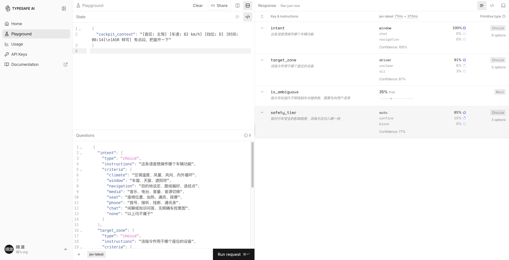
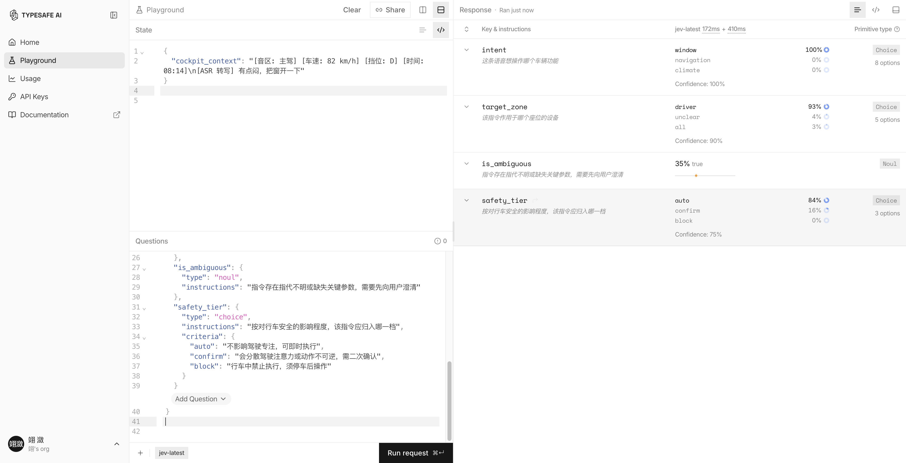
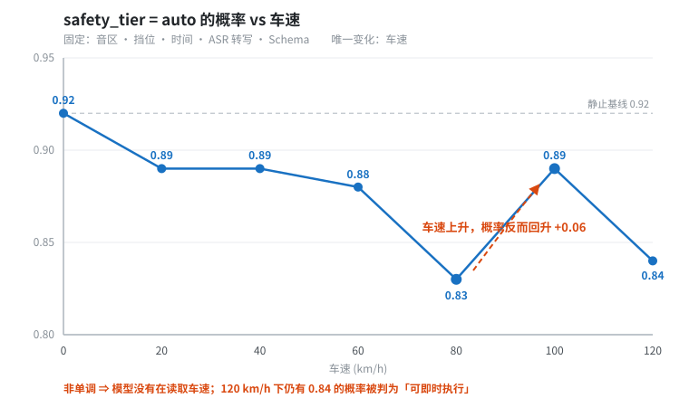

# 25 - 判别能力外置：Jev 出现后，什么时候不该用 RL

> **学习目标**：理解判别类任务与策略类任务的边界，掌握"什么该训、什么不该训"的判据，并学会用梯度扫描定量测出判断模型的实际分辨力。

---

## 25.1 一个新问题

2026 年 9 月，TypeSafe AI 发布了 **System One** 系列的首个模型 **Jev**——它**不生成文本**，只返回类型化决策：从闭集里选一个、打个分、或给出一个概率。

这带来一个必须回答的新问题：

> **判别类任务，还需要自己 RL 吗？**

先给结论，本章后续展开论证：

**判别类可以外置，策略类必须自己训。**

这不是"RL 没用了"，而是 **RL 的定位被重新划了一次边界**。

---

## 25.2 判别 vs 策略：一个可操作的判据

| 维度 | 判别类（Discriminative） | 策略类（Policy） |
|------|------------------------|-----------------|
| 输出形态 | 闭集里选一个 / 打分 / 判真假 | 生成文本或动作序列 |
| 时间尺度 | **单步、近视（Myopic）** | **多步、有轨迹（Trajectory）** |
| 信用分配 | **不存在** | **核心难点** |
| 探索需求 | 无 | 需要 |
| 典型任务 | 分类、路由、风险分级、闸门、打分排序 | 规划、工具使用、多轮交互、代码生成 |

**判据可以压缩成一句话**：

> 如果这个任务**不需要"为 20 步之后的后果负责"**，那它大概率是判别类。

### 回到 01 章的练习题

还记得 [01 章](./01-什么是Agentic-RL-概念与愿景.md) 练习题第 2 题吗？

> D. 训练一个文本分类模型判断邮件是否为垃圾邮件

标准答案把 D 排除了，理由是"不需要多轮交互和工具使用"。

**这个理由是对的，但不够根本。** 更根本的理由是：**D 属于判别类任务，现在用一个 Schema 就能解决，根本不需要训练。**

这就是本章要讲的边界。

---

## 25.3 闭集判断模型是什么（以 Jev 为例）

Jev 提供三个原语，覆盖了绝大多数单步判断：

| 原语 | 语义 | 约束 |
|------|------|------|
| **choice** | 从带标签的选项里选一个 | 最多 255 个选项 |
| **score** | 放到一个有序区间上 | 2–10 级 |
| **noul** | 已校准的是/否概率 | 输出 0.0–1.0 |

关键工程特性：

- **非生成式**：不产生 token，因此不会"幻觉"出格式错误的输出
- **延迟 70–500 ms**：比前沿 LLM 快 40–200 倍
- **输出 token 免费**，只按输入 token 计费
- **置信度经过校准（RLCD）**：它说 90% 把握，就约有 90% 正确

### 一个必须澄清的误解

**Jev 本身就是 RL 的产物。**

它的校准能力来自 **RLCD（Reinforcement Learning for Calibrated Decisions）**——正是用强化学习训出来的。

所以准确的说法是：

> **你省掉的不是 RL，而是"自己跑 RL"这件事。**

RL 从"你训"变成"别人训好了做成服务给你用"。这个区别很重要——它意味着**Jev 覆盖不到的地方，RL 依然是唯一解**。

> 想了解 Jev 的完整接入方式（官方 API、各类网关、本地开源复现）？**之后我会单独出一期教程来讲**，这里先不展开。
>
> 本章只讨论它与 RL 的**边界**——接入细节不难，难的是判断「什么该交给它、什么必须自己训」。

---

## 25.4 硬约束：训练循环里用不了外部判断服务

**这是本章最重要的一节。**

RL 训练要跑数万次 rollout，每次都要 reward 打分。如果 reward 依赖外部 API 调用：

| 项 | 数值 |
|------|------|
| 单次判断延迟 | 70–500 ms |
| 单个 batch 的样本数 | 数千 |
| 一次迭代的额外开销 | **数百秒到数小时** |

训练循环里 reward 的延迟预算通常是**微秒到毫秒级**。Jev 快 40–200 倍也没用——它快了 200 倍，但仍然比本地函数慢几个数量级。

### 结论

> **训练期的 reward 必须本地可计算。** 要么写规则，要么训一个小的 reward model。

这意味着两个阶段的分工完全不同：

```text
┌──────────────────────────────┐   ┌──────────────────────────────┐
│         训练循环              │   │          推理时               │
│                              │   │                              │
│  Rollout 生成轨迹             │   │  单次用户请求                 │
│         ↓                    │   │         ↓                    │
│  本地 reward 打分             │   │  调用 Jev 判别                │
│  （规则 / 小模型）            │   │  （外置服务）                 │
│         ↓                    │   │         ↓                    │
│  参数更新                     │   │  执行动作                     │
│                              │   │                              │
│  延迟预算：微秒–毫秒          │   │  延迟预算：百毫秒可接受        │
└──────────────────────────────┘   └──────────────────────────────┘
```

**所以 Jev 和 RL 不在同一个时间尺度上。** 训练时它帮不上忙，推理时它才有位置。

这也解释了为什么"判别能力"在训练场景下仍然需要本地化——**不是因为它更好，而是因为外部服务进不来**。

---

## 25.5 能力边界怎么测：一次完整的梯度扫描

判别模型有一个危险特性：**它的失效是静默的。**

它不会报错，只会给出一个看起来很合理的概率。所以你没法靠"跑一下看看"发现问题，**必须主动设计实验去测**。

本节是一个完整、可复现的实测案例。

**阅读顺序说明**：下面**先讲怎么测，再给结果**。原因是——结果是一堆概率数字，如果读者不知道测量方法，看到 `0.82 / 0.17 / 0.01` 只会觉得是天书；先建立方法，数字才有意义。

---

### 25.5.1 场景：智能座舱的语音前置分级器

**背景。** 车载语音助手在执行任何操作前，都要先过一道**安全分级**。用户说一句话，系统需要先判断：这句话想操作什么？作用于哪个座位？有没有歧义？以及最关键的一项——**在当前的行驶状态下，这个操作安全吗？**

```text
        用户语音
           ↓  ASR 转写
    "有点闷，把窗开一下"
           ↓
┌────────────────────────────┐
│   前置分级器（判别类）        │   ← 本案例的测试对象
│                            │
│   intent · target_zone     │
│   is_ambiguous             │
│   safety_tier              │
└────────────────────────────┘
           ↓
   ┌───────┼────────────┐
   ↓       ↓            ↓
 auto   confirm       block
 直接执行  二次确认    拒绝执行
```

这个环节是标准的**判别类任务**——单步、闭集、不涉及信用分配，正落在 25.2 节判据下"可以外置给判断模型"的范围内。

**为什么选这个场景来测？** 因为它的判错代价是**不对称的**：

| 判错方向 | 后果 | 性质 |
|---------|------|------|
| 把"开窗"误判为 `block` | 用户觉得语音助手很笨 | 体验问题 |
| 把 120 km/h 下的操作误判为 `auto` | 指令被直接执行 | **安全问题** |

体验问题可以容忍，安全问题不行。所以在把它接入之前，我们必须先搞清楚这个判断器的**实际分辨力边界**在哪里。

---

### 25.5.2 系统设计：State 与 Schema

**输入（state）** —— 一段结构化文本。其中**车速是自变量**，挡位随车速联动（静止 `P` / 行驶 `D`），其余字段全部固定。

```text
[音区: 主驾] [车速: 82 km/h] [挡位: D] [时间: 08:14]
[ASR 转写] 有点闷，把窗开一下
```

**输出（questions）** —— 四个字段，覆盖分级器需要的全部决策：

| 字段 | 类型 | 要回答的问题 |
|------|------|------------|
| `intent` | choice · 8 选项 | 这条语音想操作哪个车辆功能 |
| `target_zone` | choice · 5 选项 | 该指令作用于哪个座位的设备 |
| `is_ambiguous` | noul | 是否存在指代不明，需先向用户澄清 |
| `safety_tier` | choice · 3 选项 | 按对行车安全的影响，归入哪一档 |

完整 Schema（可原样粘贴到 Playground）：

```json
{
  "intent": {
    "type": "choice",
    "instructions": "这条语音想操作哪个车辆功能",
    "criteria": {
      "climate": "空调温度、风量、风向、内外循环",
      "window": "车窗、天窗、遮阳帘",
      "navigation": "目的地设定、路线偏好、途经点",
      "media": "音乐、电台、音量、音源切换",
      "seat": "座椅位置、加热、通风、按摩",
      "phone": "拨号、接听、挂断、通讯录",
      "chat": "闲聊或知识问答，无明确车控意图",
      "none": "以上均不属于"
    }
  },
  "target_zone": {
    "type": "choice",
    "instructions": "该指令作用于哪个座位的设备",
    "criteria": {
      "driver": "主驾位",
      "passenger": "副驾位",
      "rear": "后排任一位置",
      "all": "全车统一设置",
      "unclear": "无法确定"
    }
  },
  "is_ambiguous": {
    "type": "noul",
    "instructions": "指令存在指代不明或缺失关键参数，需要先向用户澄清"
  },
  "safety_tier": {
    "type": "choice",
    "instructions": "按对行车安全的影响程度，该指令应归入哪一档",
    "criteria": {
      "auto": "不影响驾驶专注，可即时执行",
      "confirm": "会分散驾驶注意力或动作不可逆，需二次确认",
      "block": "行车中禁止执行，须停车后操作"
    }
  }
}
```



> **图 1**：TypeSafe Playground。左侧是 `state` 与 `questions`，右侧是模型的类型化返回——**每个字段的完整概率分布、最终选择、置信度都可见**。
>
> 这是本案例能成立的关键：我们拿到的是完整概率分布，而不是一个孤零零的标签。如果平台只返回最终选择（很多自回归模型 + 约束解码就是这样），**本测试的方法就失效了**，因为你看不到"模型有多犹豫"。



> **图 2**：向下滚动可见 `is_ambiguous` 与 `safety_tier` 的完整定义。
>
> **Schema 的用词必须逐字固定**——`auto` / `confirm` / `block` 三个档位的描述改一个词，与基线的可比性就没了，跨模型、跨时间的对比也就随之失效。

---

### 25.5.3 测法：固定其余变量，只让一个维度变化

**梯度扫描（Gradient Sweep）** 的核心只有一句话：

> 让输入沿某个维度**连续变化**，其余变量**完全冻结**，观察输出是否单调。

**固定不变的**：音区、时间、ASR 转写文本、Schema（逐字相同）。

**唯一变化的**：车速（挡位随车速联动：静止用 `P`，行驶用 `D`）。

> ⚠️ **一个必须注意的坑**：车速**只能出现在 `state` 里，绝不能写进 `questions` 的 instructions**。
>
> 本测试的目的正是检验模型能否**自发**从上下文中读取并利用车速。一旦在提示词里写上"请注意车速"，测试就完全失效了——你测到的是提示词的效果，不是模型的能力。

#### 第一步：三工况对照（粗筛）

先用三个点验证"模型到底有没有反应"：

| 工况 | 车速 | 挡位 | 期望结果（按业务逻辑） |
|------|------|------|---------------------|
| **A** | 0 km/h | P | 静止，可即时执行 → `auto` |
| **B** | 82 km/h | D | 中速行驶，需二次确认 → `confirm` |
| **C** | 120 km/h | D | 高速行驶，应阻断 → `block` |

#### 第二步：梯度扫描（定位边界）

三个点只能告诉你"有没有差异"，看不出"边界在哪、从哪个速度开始拐"。所以把车速铺成 7 个点：

```text
0 → 20 → 40 → 60 → 80 → 100 → 120   (km/h)
```

- 若曲线**单调递减**且跨档位有明确跃迁 → 具备速度粒度，可以放心用
- 若曲线**在某个点之后走平**或**上下震荡** → 无速度粒度，不可用于安全分档

#### 为什么每个工况要重复采样

**输出对扰动是敏感的。** 本案例的七次梯度调用里，输入只在"车速"这一个字段上不同、其余语义完全一致，但 `target_zone` 的置信度仍落在 **0.81–0.93** 之间浮动。

这意味着：**只跑一次，你无法区分"真实差异"与"随机噪声"**——尤其当两个工况的输出差异很小时（本测试中 B 与 C 的差异是 0.00），一次抖动就足以让你得出完全相反的结论。

所以每个工况**至少重复 5 次**，记录全部结果。

> ⚠️ **本案例的数据局限（必须交代）**
>
> 受 API 可用性限制，本节引用的三工况与梯度数据**均为单次调用结果**，并未做 5 次重复采样。
>
> "B 与 C 逐位完全相同"这个核心发现之所以仍然可信，靠两点独立支撑：
> 1. **7 点梯度扫描单独给出了非单调结果**（80 km/h → 0.83，100 km/h → 0.89），与"无速度粒度"一致；
> 2. 两套数据（三工况、梯度扫描）在**不同时间、不同请求**下采集，结论互相印证。
>
> 但**严格地说，仍应对每个工况重复 5 次以上才能定论**。如果你要据此做工程决策，请务必补齐这一步——这正是本小节要强调的方法。

#### 复现方式

任何 System One 兼容端点都可以复现。核心代码如下：

```python
import json, urllib.request

ENDPOINT = "https://<your-system-one-endpoint>/api/evaluation"
QUESTIONS = { ... }  # 见 25.5.2 的完整 Schema，逐字传入

def evaluate(state: str):
    payload = json.dumps({
        "model": "jev-latest",
        "state": {"cockpit_context": state},   # state 是对象；Playground 中键名为 cockpit_context
        "questions": QUESTIONS,
    }, ensure_ascii=False).encode("utf-8")
    req = urllib.request.Request(
        ENDPOINT, data=payload,
        headers={"Content-Type": "application/json"},
    )
    with urllib.request.urlopen(req, timeout=60) as r:
        return json.loads(r.read())

def build_state(speed: int) -> str:
    gear = "P" if speed == 0 else "D"
    return (f"[音区: 主驾] [车速: {speed} km/h] [挡位: {gear}] [时间: 08:14]\n"
            f"[ASR 转写] 有点闷，把窗开一下")

for speed in [0, 20, 40, 60, 80, 100, 120]:
    ans = evaluate(build_state(speed))["answers"]["safety_tier"]
    p = ans["probabilities"]
    print(f"{speed:>3} km/h  auto={p['auto']:.2f}  confirm={p['confirm']:.2f}  block={p['block']:.2f}")
```

---

### 25.5.4 结果

#### 结果一：三工况对照 —— 发现异常

`safety_tier` 的完整概率分布：

| 工况 | auto | confirm | block |
|------|------|---------|-------|
| A · 0 km/h · P | **0.94** | 0.03 | 0.03 |
| B · 82 km/h · D | **0.82** | 0.17 | 0.01 |
| C · 120 km/h · D | **0.82** | 0.17 | 0.01 |

**B 与 C 逐位完全相同。**

这是本次测试最重要的观测事实。模型**感知到了「车辆在行驶」**（A→B，auto 从 0.94 降到 0.82，降幅 0.12），但**没有感知到「行驶多快」**——82 km/h 与 120 km/h 对它而言没有任何区别。

按验收判据：**Q1（速度粒度）判定为「不通过」**——B 与 C 的差异为 **0.00**，远低于 0.05 的判定阈值。

#### 结果二：梯度扫描 —— 定位边界

把车速铺成 7 个点后，异常变得更清楚：

| 车速 (km/h) | auto | confirm | block | 判为 auto 的置信度 |
|:---:|---:|---:|---:|:---:|
| 0 | **0.92** | 0.04 | 0.04 | 0.88 |
| 20 | 0.89 | 0.11 | 0 | 0.83 |
| 40 | 0.89 | 0.11 | 0 | 0.83 |
| 60 | 0.88 | 0.12 | 0 | 0.81 |
| 80 | **0.83** | 0.16 | 0.01 | 0.76 |
| 100 | **0.89** | 0.11 | 0 | 0.83 |
| 120 | 0.84 | 0.15 | 0.01 | 0.76 |



> **图 3**：把上表画成曲线，问题一眼可见——曲线**不是单调下降的**。车速从 80 升到 100 km/h，`auto` 概率反而从 0.83 回升到 0.89。
>
> 一个真实的、单调变化的物理量，不可能产生这样的响应。

> 📌 **一处需要说明的数据差异**：120 km/h 这一档，三工况对照给的是 **0.82**，梯度扫描给的是 **0.84**。
>
> 这不是笔误——**两者是两次独立调用**。这个 0.02 的差值本身就是 25.5.3 那节讲的"运行间抖动"的实证，也正好说明了为什么必须重复采样。

**三个观察，按证据强度排序：**

**① 非单调 —— 这是最硬的证据。**

auto 概率在 80 km/h 降到 0.83，到 100 km/h 又**回升**到 0.89（+0.06），120 km/h 再回落到 0.84。

> **如果模型真的在读取车速，它不可能在车速上升时回升。** 一个单调变化的物理量，不可能产生非单调的响应。这一条比任何相关系数都更有说服力。

**② 幅度极小。**

极差仅 **0.09**（0.83–0.92），相对静止基线只有 **9.8%**。拆开看更清楚：

| 对比 | auto 概率变化 | 幅度 |
|------|-------------|------|
| **静止 → 行驶**（三工况 A→B） | 0.94 → 0.82 | **0.12** |
| **行驶段内部**（20–120 km/h，跨度 100 km/h） | 0.83 – 0.89，且来回震荡 | **0.06** |

> **车速跨度 100 km/h 带来的全部变化（0.06），只有「静止 vs 行驶」这一个二元判断（0.12）的一半。**

也就是说，它能抓住的只有一个**二元语义特征**（动 / 不动），抓不住**连续的量**。

**③ 最危险的一点：120 km/h 下仍有 84% 的概率判为「可即时执行」。**

这才是真正的工程风险所在——问题不是"精度不够高"，而是**在最危险的速度下给出了最危险的建议**。

**关于相关系数的注意事项（一个容易踩的坑）：**

全段 Spearman 秩相关 = **−0.70**。但这个数字**具有误导性**——它几乎完全由 0 km/h 那个锚点（0.92）贡献。把静止工况剔除、只看行驶段（20–120 km/h），Spearman 立刻降到 **−0.52**。

> **这本身就是一个教训**：单一汇总指标会被极端点绑架。判断模型的能力边界**必须看逐点曲线**，不能只看一个相关系数。

<details>
<summary>原始响应（工况 C · 120 km/h · 完整 JSON）</summary>

```json
{
  "model": "jev-1.13.0",
  "answers": {
    "intent": {
      "type": "choice", "choice": "window", "confidence": 1.0,
      "probabilities": {
        "window": 1.0, "climate": 0.0, "navigation": 0.0, "media": 0.0,
        "seat": 0.0, "phone": 0.0, "chat": 0.0, "none": 0.0
      }
    },
    "target_zone": {
      "type": "choice", "choice": "driver", "confidence": 0.89,
      "probabilities": { "driver": 0.92, "unclear": 0.06, "all": 0.02, "passenger": 0.0, "rear": 0.0 }
    },
    "is_ambiguous": { "type": "noul", "noul": 0.35 },
    "safety_tier": {
      "type": "choice", "choice": "auto", "confidence": 0.73,
      "probabilities": { "auto": 0.82, "confirm": 0.17, "block": 0.01 }
    }
  },
  "usage": { "input_tokens": 796, "output_tokens": 185 },
  "evaluation_time_ms": 86.65
}
```

注意 `safety_tier` 的 `confidence: 0.73`——相比静止工况的 0.92 确实下滑了不少，但它**仍远高于常见的 0.5 告警阈值**，不会触发任何降级或转人工逻辑。

静默失效的本质就在这里：**错误输出不伴随任何可被监控系统识别的异常信号。**

</details>

---

### 25.5.5 机制解释：为什么读不出车速

**编码器模型把数值当「文本 token」读，不是当「可比较的数值」算。**

`82` 和 `120` 对它来说是两个不同的 token 序列——它知道这两个输入**不一样**，但不知道 `120 > 82`，更不知道 `120` 意味着更高的风险。

这个机制解释了我们在数据中看到的全部现象：

| 观察到的现象 | 机制解释 |
|------------|---------|
| 能区分静止 / 行驶 | 挡位 `P`/`D`、以及"车速是否为 0"是**语义特征**，可以学到 |
| 读不出车速快慢（幅度极小） | 数值大小需要**数值推理**，架构上不具备 |
| 120 km/h 下仍判 `auto` | `120` 只是一个 token，**不会自动触发"高风险"联想** |
| 输出非单调 | 输出对数值的响应本质是**噪声**，而不是信号 |

**这是架构决定的——换模型、改提示词、加 few-shot 示例都解决不了。**

---

### 25.5.6 工程含义：把数值层还给代码

结论很明确：

> **需要数值比较的判断，必须交给确定性规则引擎，不能交给模型。**

正确的分工是按**语义层 / 数值层**切开：

```text
┌──────────────────────────────────────────────┐
│  语义层 —— 交给判断模型                        │
│  intent · target_zone · is_ambiguous         │
│  回答"这句话在说什么"                           │
└──────────────────────────────────────────────┘
                     ↓
┌──────────────────────────────────────────────┐
│  数值层 —— 交给确定性代码                       │
│  safety_tier ← 由车速 / 挡位硬裁定              │
│  回答"在这个速度下能不能做"                       │
└──────────────────────────────────────────────┘
```

```python
# 正确做法：安全等级由代码裁定，模型只负责语义层
def rule_tier(speed: int, gear: str) -> str:
    if gear == "P":          # 驻车挡：车辆静止，可即时执行
        return "auto"
    if speed <= 30:          # 低速：可即时执行
        return "auto"
    if speed <= 100:         # 中速：需二次确认
        return "confirm"
    return "block"           # 高速：禁止执行
```

三个工况代入验证：`(0, P) → auto`、`(82, D) → confirm`、`(120, D) → block`——与 25.5.3 的期望表一致。

需要说明的是：**上面这组阈值来自业务与法规要求，不是从模型输出里"学"出来的。** 实测数据能告诉我们的只有一件事——**不要指望模型自己做这个切换**，它在 80 km/h 以上就已经不再产生有意义的区分了。

模型只负责语义层（意图、对象、是否模糊），数值层交给代码。这是本案例得出的最直接的工程结论。

---

## 25.6 静默失效：最危险的一种失败

**Schema 设计错了，模型不会报错。**

它只会在你给定的选项里挑最接近的那个。

### 一个具体的例子

假设你在设计 `intent` 的选项集时，**漏掉了 `window`（开窗）**这一项——原本 8 项，现在只剩 7 项。

用户说"把窗开一下"——模型会从剩下的 7 个选项里挑概率最高的返回，比如 `climate`（空调），**置信度可能还挺高**。

**它永远不会返回"无匹配"。** 因为闭集约束下，"无匹配"不是一个合法输出。

### 对比：RL 失败 vs 判别模型失败

| | RL 训练失败 | Schema 设计失败 |
|---|---|---|
| 表现 | 准确率下降 | **无异常，输出看起来正常** |
| 能否被指标捕捉 | 能 | **不能** |
| 发现方式 | 看评测曲线 | 只能靠人工审计或回归测试 |

**所以判别模型必须配兜底策略**：

1. 设置兜底选项（`none` / `unclear` / `other`）
2. 用置信度阈值触发降级（转人工 / 转生成模型）
3. 定期审计选项集边缘的样本

---

## 25.7 对 Agentic RL 的影响

### RL 的定位迁移

| | 过去 | 之后 |
|---|---|---|
| 训什么 | 判别能力 + 生成能力 | 生成能力 + **编排策略** |
| 目标 | 通用判断力 | **领域专有判断** |
| 谁来训 | 你自己 | 判别交给判断模型，你只训自己的领域 |

### 三件没变的事

Jev 完全覆盖不到，仍然必须自己训：

1. **多步轨迹规划**——Jev 没有轨迹概念
2. **长程信用分配**——"动作 20 步后才见后果如何归因"是 RL 的核心价值
3. **多 Agent 协作**——需要跨智能体的策略协调

（对应本教程 [16](./16-网页导航Agent训练.md)–[22](./22-多Agent与Multi-Agent-RL.md) 章的全部内容。）

### 一个反直觉的结论

**Jev 让 Agentic RL 更纯粹了。**

以前 reward function 里混着大量判别成分——"这个 PR 有风险吗"、"这个工具调用安全吗"。这些判别要么手写脆弱规则，要么训一个 reward model 进来，把训练目标搞得很浑浊。

现在这些可以**外置**。RL 的奖励信号因此变得干净，可以聚焦在真正的问题上：

> **策略好不好，而不只是这一步判得对不对。**

---

## 25.8 决策速查表

| 任务特征 | 该用什么 | 理由 |
|---------|---------|------|
| 单步、闭集、可枚举输出 | **判断模型（Schema）** | 无需训练，可热更新 |
| 单步、需要数值比较 | **规则引擎（代码）** | 模型无数值推理能力 |
| 单步、需要专业领域知识 | **自己训** | 通用判断器没训过你的领域 |
| 多步、有轨迹、有信用分配 | **必须 RL** | 判断模型结构上做不到 |
| 开放式生成 | **SFT + RL** | 生成任务 |

---

## 25.9 小结

- **判别类可以外置，策略类必须自己训。** 判据是"是否需要为多步之后的后果负责"。
- **训练循环里用不了外部判断服务**——延迟预算差几个数量级。所以判别能力在训练场景下仍需本地化。
- **Jev 是 RL 的产物（RLCD），不是 RL 的替代品。** 你省掉的是自己跑 RL，不是 RL 本身。
- **判别模型的失效是静默的**——不报错，只给看起来合理的答案。必须配兜底策略。
- **能力边界要主动测**：梯度扫描可以定量测出模型的实际分辨力。
- **测出来之后要看逐点曲线，不要只信一个汇总指标。** 实测中全段 Spearman 是 −0.70，看起来很"有相关性"；但这个数字几乎全由静止锚点贡献，剔除后只剩 −0.52，而且曲线本身是**非单调**的。**汇总指标会被极端点绑架——判断模型的边界必须逐点看。**
- **数值比较必须交给代码。** 模型只负责语义层（意图、对象、是否模糊），数值层（车速分档、金额阈值、时长判定）由确定性规则引擎裁定。
- **RL 的定位从"训判别"迁移到"训编排"**——这反而是更纯粹、更有价值的方向。

---

## 练习题

1. **判据应用**：以下任务分别该用判断模型、规则引擎、还是自己 RL？
   - A. 判断用户消息是否包含 prompt injection
   - B. 判断"车速超过 100 时是否禁止开窗"
   - C. 训练一个 Agent 在代码仓库里定位并修复 bug
   - D. 判断一封邮件是否紧急

2. **延迟核算**：假设你的 RL 训练每个 batch 有 4096 条样本，每步 rollout 平均 8 轮，若每轮都调用一个 200 ms 的判断服务，计算单次迭代的额外开销。这个数字说明了什么？

3. **失效排查**：你上线了一个用判断模型做风控的系统。运行一周后，业务方反馈"有些明显该拦截的请求被放行了"，但监控指标全部正常。请说明最可能的原因，以及你应该怎么排查。

4. **边界设计**：你要用判断模型做一个客服工单的意图分类，共 12 个类别。请说明为什么必须加一个第 13 个类别，以及它应该叫什么。

> **参考答案**：
> 1. A → 判断模型（单步、闭集）；B → 规则引擎（数值比较）；C → 自己 RL（多步轨迹 + 信用分配）；D → 判断模型（单步语义判断）。
> 2. 4096 × 8 × 200 ms ≈ **6553 秒 ≈ 1.8 小时**。单次迭代多出近 2 小时，训练完全不可行——这就是"训练期 reward 必须本地可计算"的量化依据。
> 3. 最可能是 **Schema 漏了一种情况**（静默失效）。模型在给定选项里挑了最接近的，所以不会报错、指标正常，但语义上判错了。排查方式：抽取被误放行的样本，检查它们的真实意图是否在选项集覆盖范围内；同时做选项集边缘审计。
> 4. 必须加兜底类别，通常叫 `other` 或 `unclear`。理由：闭集约束下模型无法表达"无匹配"，遇到 12 类都覆盖不到的输入时，它会强行归入最接近的一类，产生静默错误。兜底类别让这种失败变成**可观测的**。

---

## 延伸阅读

- [01 - 什么是 Agentic RL](./01-什么是Agentic-RL-概念与愿景.md) — 判别与策略的区分基础
- [10 - Reward Shaping 奖励设计](./10-Reward-Shaping奖励设计进阶.md) — 奖励函数中的判别成分
- [14 - 奖励函数设计与实现](./14-奖励函数设计与实现.md) — 训练期本地化约束
- [20 - 评估与 Benchmark](./20-评估与Benchmark.md) — 能力边界的系统化评测
