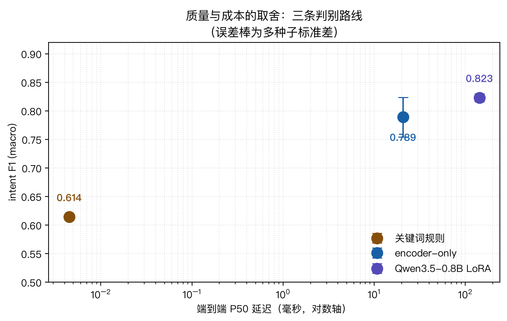
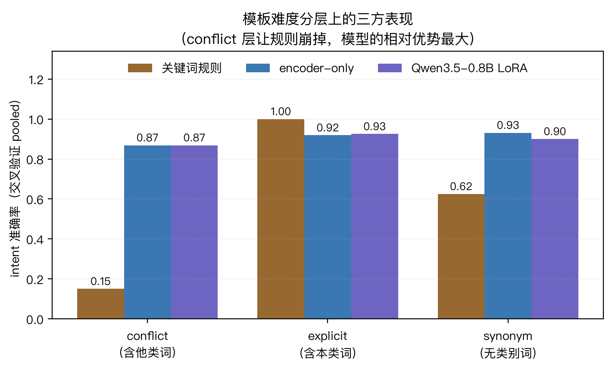
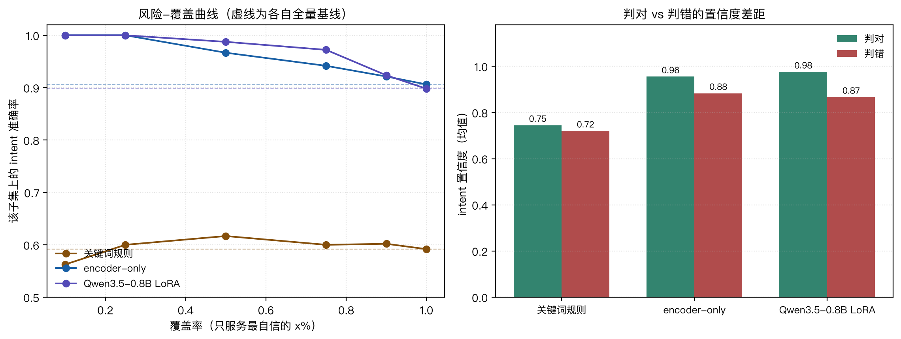
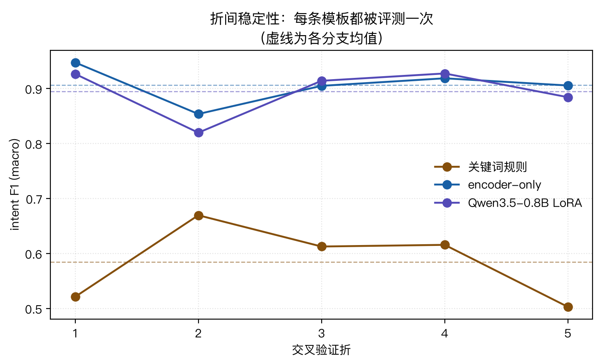

# 这个 bench 证明了什么 / 没证明什么

> 一页纸结论。完整数据在 [`reports/`](./reports/)，复现步骤在 [`README.md`](./README.md)。

## 一句话

在这个 SaaS 工单路由任务上：**语义模型显著优于关键词规则，但两条模型路线彼此分不出高下；而推理成本跨五个数量级。** 所以「上不上模型、上哪个模型」是业务定价问题，不是技术优劣问题。



## 三方对比

主口径是 **5 折交叉验证**（每条模板都被评测一次，pooled n=480，模板层面完全隔离）：

| 指标 | encoder-only | Qwen3.5-0.8B LoRA | 关键词规则 |
|---|---|---|---|
| intent F1 (macro) | **0.9058** | 0.8967 | 0.5933 |
| intent ECE | **0.0570** | 0.0746 | 0.2667 |
| escalation F1 | 0.8387 | **0.8411** | 0.6898 |
| escalation Brier | **0.1002** | 0.1138 | 0.2483 |
| complexity MAE | **0.1281** | 0.1536 | 0.1670 |
| 端到端 P50 延迟 | 20.67 ms | 142.51 ms | **0.0045 ms** |
| 部署体积 | 390.6 MB | 1728.1 MB | **0**（无需模型） |

## 证明了什么

1. **模型相对规则的提升是显著的，而且是全方位的。** 五个质量指标上，两条模型相对规则的差距是 **5~9 倍标准差**（唯一例外是 Qwen 的 complexity MAE，只有 1.08 倍）。
2. **成本跨五个数量级。** 规则 `0.0045 ms`，比 encoder 快约 4600 倍、比 Qwen 快约 32000 倍。
3. **数据泄漏能撑起 11pp 的 F1。** 修复前 test 与 train 文本 100% 重合，encoder 的 intent F1 是虚高的 `1.0000`；改为模板级隔离后掉到 `0.8911`。
4. **单次切分会给出方向相反的结论。** 单次切分（多种子）显示 Qwen 的 intent F1 领先 encoder `0.034`；5 折交叉验证下这个差距变成 `0.012`、比值仅 **0.33**——统计上无法区分。
5. **「模型 vs 规则」的分界线在「诉求 vs 背景」上。** 规则在显式样本上准确率 `1.000`，在关键词冲突样本上掉到 **`0.150`**；模型在两层上分别是 `0.92` 和 `0.87`。



6. **能力边界在训练分布之外，而且三方会在同一个地方一起崩。** 50 条人工难例（11 类失败模式）：

| 失败模式 | n | encoder | Qwen LoRA | 规则 |
|---|---|---|---|---|
| `multi_intent` 多诉求混合 | 6 | **0.33** | **0.33** | **0.33** |
| `fallback_trap` 只是问信息却被当成诉求 | 4 | 0.25 | 0.25 | **0.00** |
| `vague` 语义模糊 | 6 | 0.33 | 0.50 | **0.83** |
| `adversarial` 反问/讽刺/错别字 | 4 | 0.50 | 0.25 | 0.50 |
| `extreme_length` 极短或极长 | 4 | 0.50 | **0.75** | **0.75** |
| `negation` 否定陷阱 | 4 | 0.50 | 0.50 | **0.75** |
| `coverage` 常规覆盖 | 8 | **0.75** | 0.62 | 0.50 |
| `typo_noise` 错别字/噪声 | 4 | 0.75 | **1.00** | **1.00** |
| `synonym` 同义转述 | 5 | **1.00** | 0.40 | 0.20 |
| `jargon` 领域黑话/中英混杂 | 3 | **1.00** | 0.67 | 0.33 |
| `boundary` 复杂度边界 | 2 | 1.00 | 0.50 | 1.00 |

整体（50 条）：intent 准确率 encoder `0.600` / Qwen `0.520` / 规则 `0.540`；漏报升级 10 / 12 / 13 条。

三个新结论：

- **`multi_intent` 与 `fallback_trap` 是三方共同死穴。** 前者因为训练模板全是单一诉求；后者因为「句子里有强类别信号，但用户只是问信息」——规则在 `fallback_trap` 上**一条都没对（0.00）**，因为它的机制就是见词命中。
- **噪声对规则无害、对模型有害。** `typo_noise` 上规则 `1.00`，encoder 只有 `0.75`——错别字不影响关键词匹配（「发飘抬头」里的「抬头」还在），但会扰动语义表示。**「数据脏」不是模型的借口，也不是规则的劣势。**
- **规则在 `escalation` 上反而最好（`0.740`）且零误报**，但代价是漏报 13 条。它的策略是保守，不是准确。

> ⚠️ 50 条难例**仍不能用来给分支排名**（encoder 0.60 vs Qwen 0.52，n=50 时差异不显著）。它的用途是暴露失败模式，不是比大小。

7. **`complexity` 这个任务的可学信号主要来自 intent。** 它的标签由 `(intent, 是否含升级关键词, 文本哈希)` 生成，哈希部分不可学。所以 MAE 不该对齐 0，而应对齐下限：

| 参照 | MAE |
|---|---|
| 随机猜（全局均值） | 0.1860 |
| 只知道 intent | 0.1147 |
| 知道 intent + 关键词（**不可约下限**） | **0.0982** |

模型实测：encoder `0.1281`（距下限 +0.030）、Qwen `0.1536`（+0.055）、规则 `0.1670`（+0.069）。**71% 的可学信号只是 intent**——所以 `complexity` 不是一个独立能力，它的价值在于演示「一个 encoder 服务三种输出头」和「标签有不可约噪声时指标要对齐下限」。

## 分流与级联：直觉在这里是错的

真实系统不是「三选一」，而是**组合**——高置信度走便宜的分支，低置信度升级到贵的。
`scripts/11_cascade_benchmark.py` 用交叉验证的逐样本预测（480 条配对样本，**未重新训练**）把这条路测了：

| 策略 | intent F1 | 成本 ms | 触发率 |
|---|---|---|---|
| `encoder-only` | **0.9058** | 20.67 | — |
| `qwen-only` | 0.8967 | 142.51 | — |
| `rules-only` | 0.5933 | 0.0045 | — |
| `rule-first`（规则命中→规则，否则→encoder） | 0.7080 | 6.21 | 规则命中 70% |
| `cascade-enc2qwen`（扫 101 个阈值） | **0.9058**（最优） | ≥ 20.67 | — |
| `oracle-cascade`（**完美门控上界**） | 0.9537 | 34.03 | 升级 9.4% |

**三个结论，两个反直觉：**

1. **置信度门控完全无效。** 扫完 101 个阈值后，帕累托前沿**只剩一个点**——`encoder-only`（20.67 ms / F1 0.9058）。**没有任何阈值能同时改善质量与成本**；每一次升级都是花更多钱、拿更低质量。

2. **机制解释：不是「置信度没有信息」，而是「被挑出来的难样本，第二个分支也做不对」。** 这个问题 ECE 回答不了，得用 `scripts/12_confidence_diagnosis.py` 单独验：

| 分支 | 准确率 | ECE | 错误检测 AUROC | AURC |
|---|---|---|---|---|
| encoder | 0.9062 | **0.0570** | 0.7608 | 0.0345 |
| Qwen LoRA | 0.8979 | 0.0746 | **0.8511** | **0.0234** |
| 关键词规则 | 0.5917 | 0.2667 | **0.5224** | 0.4088 |

   - encoder 的定位能力是**中等**（AUROC `0.7608`；AURC `0.0345` 明显低于整体错误率 `0.0938`，说明只服务最自信的 90% 流量准确率能提 1.5pp）。**所以不是「置信度完全没有信息」。**
   - **但 ECE 最好的 encoder，在定位能力上反而不如 Qwen**（ECE `0.0570` vs `0.0746`，AUROC `0.7608` vs `0.8511`）——**校准好 ≠ 能定位错误，ECE 不是充分验收标准。**
   - 规则的 AUROC 只有 `0.5224`（≈ 0.5），风险-覆盖曲线是**平的**——它的置信度只有两个固定取值，结构性无法定位错误。
   - 完美门控能到 `0.9537`（`+0.0479`），但 encoder 的 45 条错误里 Qwen 只修得动约一半，而用置信度精确挑出这些样本做不到。**升级链的价值取决于「第二个分支在第一个分支的错误上是否更强」，不是第一个分支的置信度好不好。**



3. **规则优先级联是取舍，不是「更划算」。** 它覆盖 70% 的流量、成本降到 `6.21 ms`（encoder 的 30%），但 F1 从 `0.9058` 掉到 `0.7080`——**掉 20 个百分点**。省 70% 成本换 20pp 质量值不值取决于业务，但它绝不是免费的。

> **这一节的教训**：「便宜的分支兜简单流量、贵的处理难流量」听起来天经地义，但它依赖一个前提——**便宜分支的置信度能定位自己的错误**。这个前提不成立时，级联只会更贵更差。

## 没证明什么

1. **没证明 encoder 比 LLM 更好。** 除 complexity MAE 外，两者在所有指标上都统计上无法区分。选 encoder 的理由是**成本低 7 倍**，不是质量更高。
2. **没证明这个任务需要模型。** 在早期的「关键词对齐」数据集上，规则基线拿 F1 `1.0000`，比两个模型都高。当前结论对数据集难度**高度敏感**——见 [28 章 28.6 难度标定](../28-数据工程I-标注协议与难例覆盖.md)。
3. **没证明结论能迁移到真实业务数据。** 全部是合成数据（120 条人工模板 × 4 种后缀）。真实工单的长度分布、噪声、长尾表达都没有覆盖。
4. **没有训练侧成本。** 只有推理成本。Qwen LoRA 的训练耗时约是 encoder 的 8 倍，未做量化对比。
5. **延迟只在 MPS / fp32 上测过。** 没有 CUDA，没有 ONNX / 量化，没有真实并发（批大小只是近似档位）。

## 最容易被误读的三个点

1. **「encoder 和 Qwen 打平」不等于「随便选一个」。** 打平的是质量，差 7 倍的是成本。默认选 encoder。
2. **「规则 F1 只有 0.59」不等于「规则没用」。** 规则在显式样本上是 `1.000`，而且快 4600 倍——它在**高确定性流量**上是无可替代的。

   > ⚠️ **更正**：本节早期版本写过「先用规则兜住简单流量、模型只处理难的那部分往往是更划算的架构，数据支持它」。**这个断言是错的，而且当时并未验证过。** 实测见下面的「分流与级联」。
3. **所有数字都依赖数据集难度。** 换了数据分布，这三个数会一起变。

## 一个方法上的提醒

训练在 MPS 上**不是确定性的，而且幅度远超预期**：用完全相同的 seed 与超参跑三次 encoder，intent F1 分别是 `0.7404` / `0.7638` / `0.8424`——**极差 `0.102`**，比交叉验证的折间标准差（`0.0304`）大三倍多。所以：

- 单次运行的结论不可信，至少要看多种子方差；
- 分支间的细微差距（< 1 倍标准差）不要过度解读；
- **能报交叉验证就报交叉验证**——它让每条模板都被评测一次，等效样本量翻 K 倍，而且不需要新写一条数据。



## 复现

```bash
cd minimal-decision-bench
make sync
make main          # 造数据 → 训两条分支 → 三方对比 → 难例 → 延迟 → 图表
make cv            # 5 折交叉验证（约 40 分钟）
make check         # lint + 测试 + 教程链接
```
